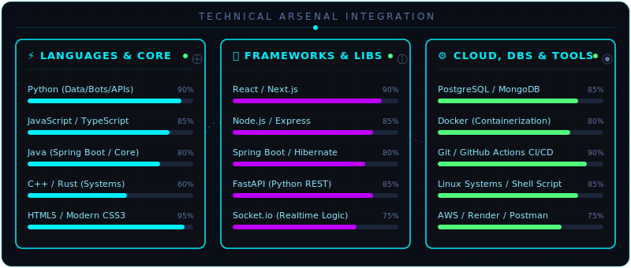
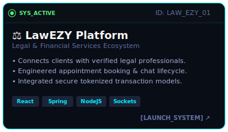
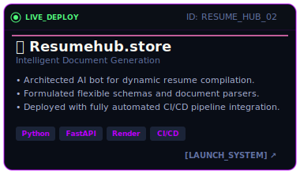
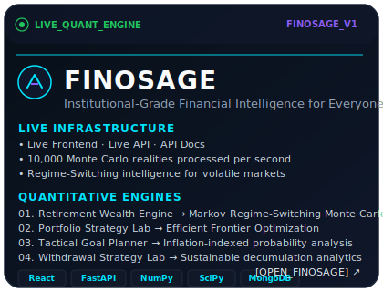

  <!-- Interactive Terminal Header SVG -->
  

 

  <h3>🚀 Full-Stack Engineer | System Architecture Enthusiast | AI & Cloud Innovator</h3>
  
<i>Always open to discussing system architecture and modern software engineering practices!</i>

  
  
  
  
  

 

---

## 👨‍💻 System Diagnostic: About Me

<table align="center" border="0" style="border: none !important; width: 100%;">
  <tr>
    <td width="60%" valign="top" style="border: none;">
      

        Software Engineer passionate about crafting full-stack ecosystems and intelligent automation workflows. 
        Whether it's designing dynamic user interfaces, structuring robust Python APIs, optimizing cloud infrastructure, 
        or deploying AI-driven solutions—I thrive at the intersection of innovation and reliability.
      

      <ul>
        <li>🚀 <b>Currently:</b> Engineering highly scalable backend architectures and dynamic React frontends</li>
        <li>🧠 <b>Focus Areas:</b> Full-Stack Development, Cloud Integration, AI/ML Automation, System Design</li>
        <li>💬 <b>Ask Me About:</b> React, Node.js, Spring Boot, Hibernate, Python Architecture, Docker, Cloud Deployments</li>
        <li>🎯 <b>Goal:</b> Building systems that scale, perform, and adapt</li>
      </ul>
    </td>
    <td width="40%" align="center" valign="middle" style="border: none; padding: 0 20px;">
      
    </td>
  </tr>
</table>

 

---

## 🛠️ Technical Arsenal

  

**Core Competencies:**
- **Frontend:** React, TypeScript, Tailwind CSS, Responsive Design
- **Backend:** Node.js, Python, Spring Boot, REST APIs, GraphQL
- **Databases:** PostgreSQL, MongoDB, MySQL, Redis
- **Cloud & DevOps:** AWS, Docker, Kubernetes, CI/CD Pipelines
- **Tools & Frameworks:** Git, Hibernate, Webpack, Next.js, Express.js

 

---

## ⚡ Featured Projects

<table align="center" border="0" style="border: none !important; width: 100%;">
  <tr>
    <td width="48%" align="center" style="border: none; padding: 10px;">
      
      
<b>LawEZY</b> - Legal Tech Platform

    </td>
    <td width="48%" align="center" style="border: none; padding: 10px;">
      
      
<b>ResumeHub</b> - Professional Resume Builder

    </td>
  </tr>
  <tr>
      <td width="48%" align="center" style="border: none; padding: 10px;">
      
      
<b>Finosage</b> - Wealth Management Guider

    </td>
  </tr>  
</table>

 

---

## 📊 GitHub Statistics

  
  

 

---

## 📫 Connect With Me

  

  💡 Have an interesting project or idea? Let's collaborate and build something amazing together!

 

  <code style="font-family: 'Fira Code', monospace; color: #6272a4; display: block; padding: 15px;">
    ╔═══════════════════════════════════════════════════════╗ 
    ║   ❯ © 2026 Shashank Kumar — Architecting Tomorrow     ║ 
    ╚═══════════════════════════════════════════════════════╝
  </code>

